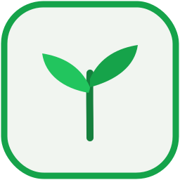

<p align="center">
  
</p>

# 🌱 Sprout

**A small, friendly programming language — built completely from scratch.**

Sprout is a real interpreted language with its own lexer, parser, and
tree-walking interpreter. No transpiling, no frameworks, **no dependencies** —
just source text turning into a running program.

Its one big idea: **be the kindest language to learn programming with.** Where
most languages throw cryptic errors, Sprout points at the exact spot and
explains the problem in plain English.

```
🌱 Oops — name problem on line 2:

  2 | show "Hi, " + nme
    |               ^

  I don't know what 'nme' is.

  💡 Did you mean 'name'?
```

📚 **Full documentation:** the **[wiki/](wiki)** covers all of Sprout and Bloom —
start at [wiki/README.md](wiki/README.md) or the [cheat sheet](wiki/cheatsheet.md).

## A taste

Sprout has its **own** vocabulary — it doesn't borrow `let`, `print`, or `if`
from anyone:

```sprout
make name = "world"
show "Hello, " + name + "!"

~ Count to 20 — FizzBuzz
make n = 1
repeat while n <= 20:
    when n % 15 == 0:
        show "FizzBuzz"
    orwhen n % 3 == 0:
        show "Fizz"
    orwhen n % 5 == 0:
        show "Buzz"
    otherwise:
        show n
    set n = n + 1
```

## Install the `sprout` command

Sprout needs **Node 23.6+** (it runs the TypeScript source directly — no build
step). Link the `sprout` command so you can use it anywhere, just like `python`:

```bash
git clone https://github.com/fizzexual/Sprout-.git
cd Sprout-
npm link          # creates the global `sprout` command
```

Then:

```bash
sprout version
sprout examples/hello.sprout        # run a program (Python-style)
sprout run examples/primes.sprout   # the same, but explicit
sprout repl                         # interactive prompt
```

Sprout programs use the **`.sprout`** extension. There are more to try in
[`examples/`](examples): `hello`, `fizzbuzz`, `triangle`, `math`, `primes`,
`functions`, the GUI apps `gui-counter` & `gui-greeter`, and the website
`server_example`.

> Don't want to install anything? You can always run it directly:
> `node src/cli.ts run examples/hello.sprout`

### Double-click to run (Windows)

Make `.sprout` files runnable straight from Explorer — double-click one and it
runs (a window for GUI apps, a website for `server` apps). This **also installs
Botanica** as an "Open with" editor for `.sprout`/`.bloom`:

```powershell
powershell -ExecutionPolicy Bypass -File tools\install-file-association.ps1
```

This is per-user only (no admin needed) and reversible:

```powershell
powershell -ExecutionPolicy Bypass -File tools\uninstall-file-association.ps1
```

## Playground (a GUI in your browser)

Sprout comes with a little playground — a code editor with a **Run** button and
live output, served by a zero-dependency Node server:

```bash
npm run play      # then open http://localhost:3000
```

Type a program, hit **Run** (or <kbd>Ctrl</kbd>+<kbd>Enter</kbd>), and see the
output instantly. There's a dropdown of examples to start from, and runaway
loops are stopped automatically.

## Build a GUI 🪟

Sprout can make real **native windows** — written entirely in Sprout. A `button`
runs a `task` when clicked, `label` updates what's on screen, and `field` reads
what the user typed.

```sprout
make count = 0

task add():
    set count = count + 1
    label("display", "Count: " + count)

window("Counter")
label("display", "Count: 0")
button("Add one", "add")
```

**Just open the file** — once the installer below is run, double-click it and the
window appears. No terminal needed. (Or from a shell: `sprout gui examples/gui-counter.sprout`.)

A program that calls **`server("Title")`** instead of `window("Title")` runs as a
**website** when opened — see [`examples/server_example.sprout`](examples/server_example.sprout)
(or `sprout serve examples/server_example.sprout`).

GUI building blocks: `window(title)` / `server(title)`, `label(id, text)` (call
again to update it), `button(text, taskName)`, `field(id, hint)`, and
`textof(id)`. Try `examples/gui-greeter.sprout` too (it has no `style`, so it
shows the raw look).

## Style it with Bloom &nbsp;

**Bloom** is Sprout's own styling language — its version of CSS. Point at a
`.bloom` file from your program with `style`:

```sprout
style "gui-counter.bloom"

window("Counter")
label("display", "Count: 0")
button("Add one", "add")
```

```bloom
~ gui-counter.bloom
window:
    background: #1a1030
    text: #f0e9ff
    font: Segoe UI 14

#display:
    size: 26
    text: #c9a8ff

button:
    background: #8a5cff
    rounded: 12
```

Style by widget kind (`window`, `label`, `button`, `field`) or by one widget's
id (`#display`). The same Bloom file styles **both** the native window and the
website. **No `style`? You get raw, unstyled output — like HTML with no CSS.**

## Botanica — the editor &nbsp;

**Botanica** is Sprout's own code editor — a real desktop app built on the same
stack as VS Code (**Electron + Monaco**). File explorer, tabs, Sprout/Bloom
syntax highlighting, minimap, and a **Run ▶** button.

```bash
npm run botanica      # first run downloads Electron + Monaco, then opens it
```

**Install it as a real app** (adds it to the Windows search bar / Start menu):

```powershell
powershell -ExecutionPolicy Bypass -File botanica\install-botanica.ps1
```

Then just type **Botanica** in the Windows search bar and press Enter (or use
the new Desktop icon). Remove it later with
`botanica\uninstall-botanica.ps1`.

Prefer a real double-click **Setup.exe**? Build one with `cd botanica && npm run dist`
— it produces `botanica/dist/Botanica Setup <version>.exe` (installs into Program
Files with an uninstall entry, like any app).

You can also **right-click a `.sprout`/`.bloom` → Open with → Botanica**, and
double-clicking a `.bloom` opens it in Botanica. Pressing **Run** opens your
app — no terminal, ever. Source: [`botanica/`](botanica).

## Tests

Sprout has a test suite that runs real programs and checks their output, using
Node's built-in test runner — still **no dependencies**:

```bash
npm test          # or: node --test test/sprout.test.ts
```

## The language so far (v0.3)

| Feature | Sprout |
| --- | --- |
| Create a variable | `make score = 0` |
| Change a variable | `set score = score + 1` |
| Print | `show "hi", name, 1 + 2` |
| Math | `+ - * / %` and parentheses |
| Text | `"a" + "b"`, joins with anything |
| Comparisons | `== != < <= > >=` |
| Logic | `and`, `or`, `not` |
| Conditions | `when` / `orwhen` / `otherwise` |
| Loops | `repeat while cond:` and `repeat N times:` |
| Tasks (functions) | `task greet(name):` … `give value` (with recursion) |
| GUI apps (native) | `window(title)` + `label` / `button` / `field` / `textof` |
| Websites (server) | `server(title)` + the same widgets, runs in a browser |
| Hidden backend | server logic never reaches the browser — only button tasks can run |
| Verified first | the whole program is checked before it runs (`sprout check`) |
| Styling (Bloom) | `style "theme.bloom"` — or raw output if omitted |
| Editor | **Botanica** — a VS Code-style editor (Electron + Monaco) in `botanica/` |
| Booleans | `yes` / `no` |
| Built-in functions | `sqrt(16)`, `max(3, 9)`, `length("hi")`, `upper(s)` |
| Comments | `~ like this` |
| Kind errors | points at the spot, suggests fixes |

**Built-ins so far:** `abs` · `round` · `floor` · `ceil` · `sqrt` · `min` · `max` · `length` · `upper` · `lower` · `random`

## How it works

```
source text
   │  lexer.ts        →  tokens (words & symbols, with indentation)
   ▼
 tokens
   │  parser.ts       →  a syntax tree (AST)
   ▼
syntax tree
   │  interpreter.ts  →  walks the tree and runs it
   ▼
output
```

| File | Job |
| --- | --- |
| `src/lexer.ts` | Turn text into tokens (handles indentation → INDENT/DEDENT) |
| `src/parser.ts` | Recursive-descent parser → AST |
| `src/interpreter.ts` | Tree-walking evaluator |
| `src/errors.ts` | The friendly error type + pretty-printer |
| `src/cli.ts` | The `sprout` command (run a file, or REPL) |

## Roadmap

- [x] **v0.1** — original syntax (`make`/`set`/`show`/`when`/`repeat`), math, text, built-ins, tests, kind errors
- [x] **v0.2** — functions: `task greet(name):` and `give` (return), plus recursion
- [x] **GUI apps** — real **native windows** from a `.sprout` file
- [x] **Server** — `server(...)` runs the same app as a website
- [x] **Bloom** — Sprout's styling language; `style "..."`, raw if omitted
- [x] **Botanica** — a real VS Code-style editor (Electron + Monaco) in `botanica/`
- [x] **Just open a file** — double-click runs it; no terminal needed
- [x] **Playground** — edit & run Sprout in the browser (`npm run play`)
- [ ] **next** — lists & a `for each` loop
- [ ] **next** — `ask` for input + a bigger standard library
- [x] **Botanica installer** — `npm run dist` builds a standalone `Botanica Setup.exe`
- [x] **Wiki** — full Sprout + Bloom docs in [`wiki/`](wiki)
- [x] **Verify before running** — the whole program is checked first (`sprout check`)
- [x] **Hidden backend** — server logic stays server-side; only button tasks run
- [x] **Open with Botanica** — right-click context-menu entry (with icon)
- [ ] **next** — more widgets (checkboxes, sliders, images, layout rows)

---

Made from scratch, one slice at a time. 🌱
