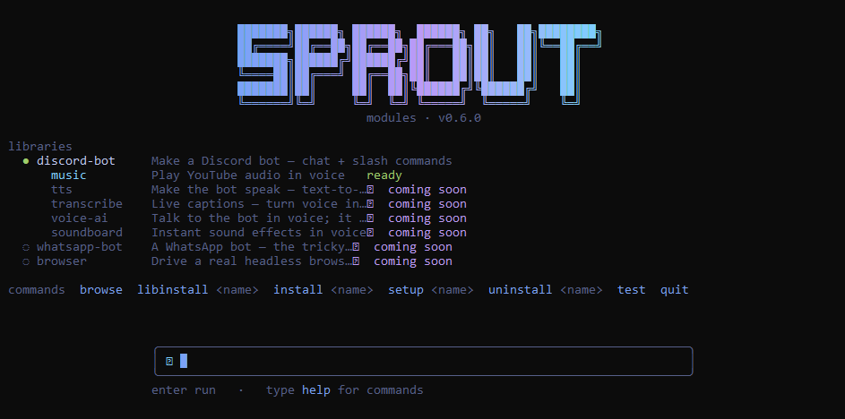

<p align="center">
  
</p>

<h1 align="center">🌱 Sprout</h1>

<p align="center">A small, friendly programming language — built from scratch, with zero dependencies.</p>

<p align="center">
  <a href="https://github.com/fizzexual/Sprout-/releases/latest"></a>
  <a href="LICENSE"></a>
  
  =23.6" />
</p>

<p align="center">
  <a href="https://github.com/fizzexual/Sprout-/releases/latest">Download</a> ·
  <a href="wiki/README.md">Documentation</a> ·
  <a href="wiki/cheatsheet.md">Cheat sheet</a>
</p>

---

Sprout is a real interpreted language — its own lexer, parser, and tree-walking interpreter. No transpiling, no frameworks, no dependencies. It has one goal: **be the kindest language to learn programming with.**

Where most languages throw cryptic errors, Sprout points at the exact spot and explains it in plain English:

```
🌱 Oops — name problem on line 2:

  2 | show "Hi, " + nme
    |               ^

  I don't know what 'nme' is.

  💡 Did you mean 'name'?
```

## Hello, Sprout

```sprout
make name = "world"
show "Hello, " + name + "!"
```

```bash
sprout run hello.sprout
```

Sprout has its own vocabulary — `make`, `set`, `show`, `when`, `repeat`, `task` — it doesn't borrow `let`, `print`, or `if` from anyone.

## Install

**Windows** — download [`SproutSetup.exe`](https://github.com/fizzexual/Sprout-/releases/latest/download/SproutSetup.exe) and run the wizard. It registers the `sprout` command, file types, and shortcuts.

**From source** (any OS, needs Node 23.6+) — Sprout runs its TypeScript directly, so there's no build step:

```bash
git clone https://github.com/fizzexual/Sprout-.git
cd Sprout-
npm link
```

## What you can build

- **Programs** — variables, math, text, conditions, loops, lists & maps, `for each`, and `task` functions
- **Multi-file projects** — split your code across files with `use "file.sprout"`
- **Desktop apps & websites** — `window("Title")` for a native window, `server("Title")` for a site — the same code, either way
- **Styling** — Bloom, Sprout's own CSS, with `style "theme.bloom"`
- **Data & the internet** — `remember` / `recall` to save between runs, `get` / `post` for any API, `secret(...)` to keep tokens out of your code
- **Libraries** — `use "discord-bot"` (a real Discord bot + music player), `use "networking"` (IP, ping, downloads), `use "automations"` (scheduled tasks)

## Libraries

Add powers with `use "..."`, then install and browse them from a built-in terminal UI — `sprout modules`:

<p align="center">
  
</p>

## Commands

```
sprout run file.sprout          run a program
sprout fast file.sprout         run it compiled to JavaScript (faster than Python)
sprout build file.sprout        build a standalone .exe (asks the size) — runs with no Node
sprout build file --standalone  build the .exe without the question (+ --no-compress)
sprout bench file.sprout        time it on both engines and compare the speed
sprout gui file.sprout          open it as a native window
sprout serve file.sprout        run it as a website
sprout check file.sprout        verify it without running
sprout explain file.sprout      run it and narrate each step
sprout trace file.sprout        step through it line-by-line, watching variables
sprout new myapp                create a starter program to get going fast
sprout modules                  install / browse libraries
sprout repl                     interactive prompt
```

## How it works

```
source → lexer → parser → interpreter → output
```

A handful of small, dependency-free TypeScript files. The full pipeline is documented in the [wiki](wiki/README.md).

## How fast is it?

Sprout has **two engines for the same language**:
- **`sprout run`** — a tuned tree-walking interpreter: instant, friendliest errors, no build step.
- **`sprout fast` / `sprout build`** — compiles your program to JavaScript and runs it on V8. **Faster than Python.**

Best-of-5 wall-clock, one machine (Node 25). Same three programs in each language:

| Benchmark | `sprout run` | **`sprout build`** (compiled) | Python 3.11 | Node (JS) | Go | Java 21 |
| --- | --- | --- | --- | --- | --- | --- |
| Recursion — `fib(30)` | 0.89s | **0.15s** | 0.25s | 0.09s | 0.03s | 0.10s |
| Tight loop — 5,000,000× | 0.77s | **0.16s** | 0.62s | 0.10s | 0.03s | 0.10s |
| Primes — < 80,000 | 0.65s | **0.18s** | 0.22s | 0.09s | 0.04s | 0.11s |

**Compiled Sprout beats CPython on every benchmark** — it runs as real JavaScript on V8 (so it lands within ~2× of Node, and well ahead of Python). The interpreter stays the friendly default for quick scripts and the kindest errors; `sprout fast` is there when you want the speed — *same `.sprout` file, your choice of engine*. (Compile mode covers the core language; programs that `use` a library or open a GUI just run on the interpreter.) Reproduce: [`benchmarks/`](benchmarks) → `bash benchmarks/bench.sh`.

**Measure your own code:** `sprout bench yourfile.sprout` times it on both engines and prints the difference:

```
🌱  sprout bench  fib.sprout   (execution time)

  interpreter    168.3 ms  ±  5.7  (15 runs)   ████████████████████████████████████████
  compiled         7.1 ms  ±  0.6  (40 runs)   ██

  → compiled ran 23.9× faster than the interpreter
```

## Share it — one file, no install

`sprout build my-game.sprout --standalone` bundles your whole program — runtime and all — into a **single `my-game.exe`** that runs on a machine with **no Node and no Sprout installed**. Just double-click it, or send it to a friend.

It's one command: the first time, it sets up its build tools itself, then compresses the result down to **~20 MB** (it embeds a JavaScript engine, like every "compile to exe" tool — `--no-compress` skips the shrink step). Multi-file projects (`use "other.sprout"`) and interactive ones (`ask`) bundle in too.

## Documentation & tooling

The **[wiki](wiki/README.md)** teaches the whole language and Bloom — the [cheat sheet](wiki/cheatsheet.md) is the one-page tour. A **VS Code extension** ([`vscode-extension/`](vscode-extension)) adds syntax highlighting, snippets, and run buttons, and the test suite runs with `npm test` — still zero dependencies.

---

<p align="center"><sub>Made from scratch, one slice at a time. 🌱</sub></p>
